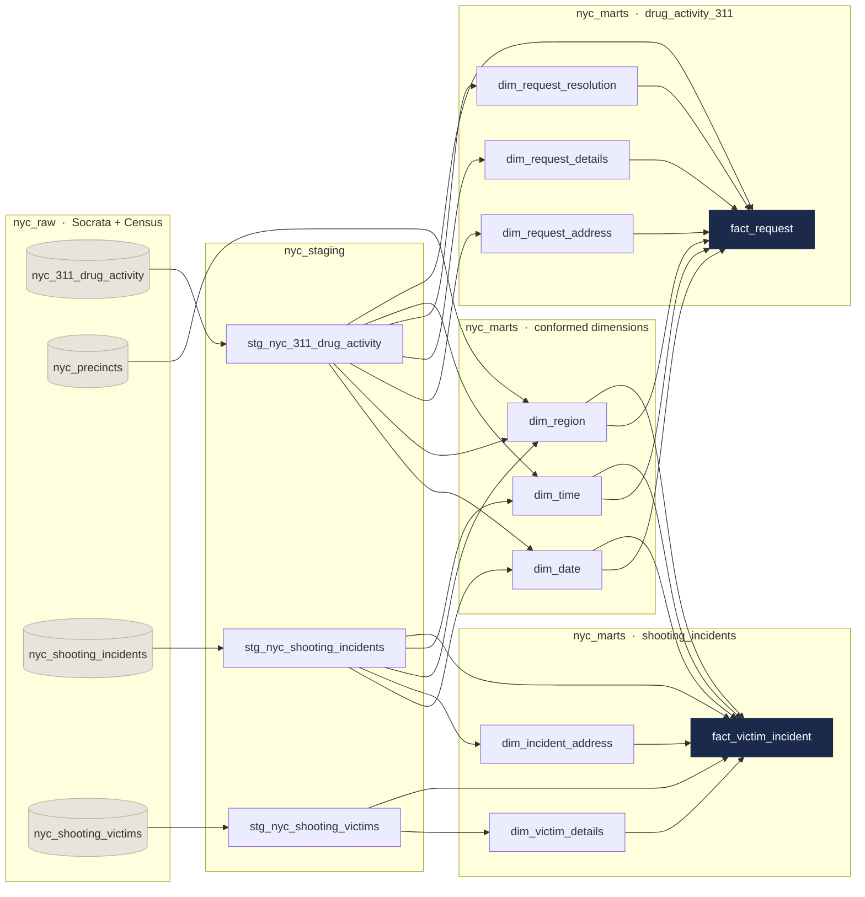

# NYC Public Safety Data Warehouse

[](https://github.com/kbeqiraj/nyc-public-safety-warehouse/actions/workflows/dbt.yml)

An analytics engineering project that pulls three NYC Open Data sources through a scheduled 
serverless pipeline, models them into a Kimball star schema on BigQuery with dbt, and feeds a
Looker Studio dashboard looking at drug-activity complaints, NYPD enforcement outcomes, and
shooting incidents together.

Built with BigQuery, Cloud Functions (Python), Cloud Scheduler, dbt, Looker Studio, and SQL.

## Overview

NYC publishes 311 service requests and NYPD shooting incidents as separate datasets with nothing
linking them. Neither one can answer a question about the other. This project loads both and puts
them behind conformed dimensions, so complaint patterns and shooting patterns can be looked at at
the same borough and precinct level, normalized per capita against 2020 Census population.

The two questions the model was built to answer:

1. How do drug-activity complaints and police response outcomes relate to shooting incidents at the
   precinct level, and does that relationship change over time?
2. How are complaints distributed across neighborhoods and time, how does the NYPD actually respond
   (arrest, summons, or nothing), and does the response differ by geography?

## Architecture

```
NYC Open Data (Socrata API)
        |
        |  3 x Cloud Functions (Python + sodapy, 5,000-record pagination,
        |  explicit BigQuery SchemaField enforcement), on a Cloud Scheduler cadence
        v
   nyc_raw                source data, kept unmodified
        |
        |  dbt: type casting, dedup, standardization
        v
   nyc_staging            3 models
        |
        |  dbt: surrogate keys, conformed dimensions, facts
        v
   nyc_marts              2 facts, 8 dims, 2 marts
        |
        |  BigQuery views implementing the KPIs
        v
   nyc_analytics_views    ->  Looker Studio dashboard
```

### Model Lineage



More detail in [`docs/ARCHITECTURE.md`](docs/ARCHITECTURE.md).

## Data Sources

| Source | Grain | Volume | Notes |
|---|---|---|---|
| NYC 311 Service Requests | One row per service request | 89K raw, 84K modeled | Filtered to `agency = NYPD` and `complaint_type = 'Drug Activity'` out of a 20M+ row dataset |
| NYPD Shooting Incidents | One row per incident | 28K | Incident level: date, time, precinct, location |
| NYPD Shooting Victims | One row per victim | 28K raw, 25K modeled | Joined to incidents on `incident_key` |
| 2020 Decennial Census | One row per precinct | Precinct level | Population and geometry, for per-capita normalization |

## Dimensional Model

Two fact tables sharing three conformed dimensions. The shared dimensions are the whole point:
they're what makes the two marts comparable.

Facts:

| Table | Grain | Rows |
|---|---|---|
| `fact_request` | One 311 drug-activity service request | ~84K |
| `fact_victim_incident` | One victim per shooting incident | ~25K |

Conformed dimensions, shared by both facts:

| Dimension | Purpose |
|---|---|
| `dim_date` | Year, quarter, month, day of week, weekend flag, fiscal year |
| `dim_time` | Time-of-day analysis and hourly distributions |
| `dim_region` | Borough by police precinct, extended with Census population and precinct geometry |

Mart-specific dimensions are `dim_request_details`, `dim_request_resolution` and
`dim_request_address` for the 311 mart, and `dim_victim_details` and `dim_incident_address` for
shootings.

Surrogate keys all come from `dbt_utils.generate_surrogate_key()` (MD5). The degenerate keys
`request_id`, `incident_id` and `victim_id` stay on the facts so rows can be traced back to the
source systems.

## Challenges and Decisions

### fact_request came back with 133K rows instead of 84K

The grain said one row per service request, so 84K, but the fact table kept returning around 133K.
`dim_request_address` turned out to be the cause. Identical physical addresses that sit on NYC
council-district boundaries arrive with different `council_district` values, so a single address
generated several dimension rows and multiplied the fact on join. Grouping on address and ZIP and
collapsing the conflicting attributes with `MAX()` and `MIN()` brought it back to 84K.

### A 4x fan-out in the shooting mart

Same class of problem. The same location type appeared with several different classification
combinations, so joining on location description alone duplicated victim rows. I replaced it with a
composite surrogate key across all three location fields: `location_desc`, `classification_code`
and `inside_outside_indicator`.

### Splitting the date-time dimension

The first version had a single `dim_date_time`. The cardinality got unmanageable and temporal
analysis was awkward to write. Splitting it into `dim_date` and `dim_time` is what made the lag
analysis and the time-of-day heatmaps possible at all.

### Duplicate keys in the source feeds

Both shooting tables ship duplicate primary keys. I handle it in staging with `QUALIFY
ROW_NUMBER()` instead of a `DISTINCT` further down, so the grain is fixed before anything joins
to it.

### Data Quality

Four things in the source data would have skewed the analysis if I'd left them alone.

The big one: precincts 107 and 110 in Queens hold 56,032 of 84,627 complaints between them, which
is 66% of the entire dataset. Precinct 107 on its own records 3,136 complaints per 10,000 residents
against 278 for the highest genuine precinct, an 11x gap. 311 assigns precinct from what the caller
says rather than geocoding the incident, so these two look like fallback values for requests that
can't be located. I exclude both from the precinct-level maps. The effect is visible in the
committed [analytics output](data/analytics_output/).

Complaint volume also rises about 24x between 2020 and 2025, which isn't a believable change in
actual drug activity. It reflects how 311 intake and categorization changed. Shooting counts over
the same period stay flat and are the more trustworthy series.

Precinct 22 is Central Park, with a recorded residential population of 25. Any per-capita rate
there is meaningless, so it's excluded by a population threshold. There's also a corrupt
`victim_age_group` value of `1022` that gets mapped to `Unknown`.

One thing I deliberately left in place: the 311 feed has a real gap between roughly April 2021 and
January 2022, which lines up with reduced 311 activity during COVID lockdown. That's in the
upstream source, so it's documented here rather than patched over.

### Materialization

Every model is a full-rebuild table, sized to the data. At 84K and 25K rows the warehouse rebuilds
in seconds and scans a few megabytes, so partitioning and clustering would add more overhead than
they save. At a few hundred gigabytes I would partition both facts on their date key, cluster
`fact_request` on `police_precinct`, and make it incremental.

Source freshness is configured on the two feeds that carry a load timestamp, so
`dbt source freshness` catches a scheduler that has quietly stopped firing.

## Metrics

| Metric | Definition |
|---|---|
| Drug Activity Complaint Rate | Complaints per 10,000 residents, by precinct |
| Shooting Incident Rate | Shooting incidents per 10,000 residents, by precinct and borough |
| Drug Activity / Shooting Correlation | Pearson correlation of monthly complaint and shooting rates, citywide and by borough |
| Lag Correlation | Complaint volume against shootings 1 to 2 months later, which holds up better than a direct ratio |
| Enforcement Outcome Distribution | Share of complaints by NYPD resolution (arrest, summons, no action), by borough |
| Hotspot Score | Min-max normalized composite of per-capita complaint and shooting rates |
| Murder Rate | Fatal shootings as a share of distinct shooting incidents, by borough |

Headline figures out of the finished warehouse: 84.6K drug-activity complaints, 20.1K shooting
incidents, 25K victim records, and 3,918 murders, a 19.83% murder rate.

## Results

I expected complaints and shootings to track each other at the precinct level. They don't.

Across the 75 precincts left after dropping the two fallback precincts and Central Park, the
Pearson correlation between complaints per 10,000 residents and shootings per 10,000 residents is
**0.08**. The borough numbers say the same thing:

| Borough | Complaints per 10k | Shootings per 10k |
|---|---|---|
| Manhattan | 54.8 | 16.6 |
| Bronx | 42.6 | 41.7 |
| Brooklyn | 23.6 | 31.5 |
| Staten Island | 15.8 | 12.2 |
| Queens | 276.9 | 13.2 |

Manhattan has the highest genuine complaint rate in the city and one of the lowest shooting rates.
The Bronx is close to the reverse. Queens only looks like that because precincts 107 and 110 are
still in the borough rollup, which is the fallback artifact described above. At precinct level the
split is wider: Brooklyn's 73rd has the highest shooting rate anywhere, 124 per 10,000 residents,
and sits near the bottom for complaints at 13.5.

The monthly numbers gave me more trouble. Pearson *r* is -0.21 in the same month, -0.28 with
shootings lagged one month, -0.39 at two months, -0.45 at three. I spent a while treating that as a
real lag effect before noticing that the correlation strengthens with every extra month I add,
which is what two series trending in opposite directions will do regardless of any relationship
between them. Complaints go from 4,390 in 2020 to 27,964 in 2025 while shootings fall from 1,532 to
688. Given that the complaint trend is mostly 311 intake changes, I report this as a null result.

Manhattan's 25th Precinct is the one that lands near the top of both lists, at 277.8 complaints and
66.5 shootings per 10,000 residents. That is the kind of overlap the hotspot score was meant to
surface, and it only becomes visible once the fallback precincts stop dominating the ranking.

For anyone using this data: 311 drug complaints describe reporting behavior more than they describe
drug activity or violence. A model that treats complaint volume as a proxy for either one will rank
Manhattan and Queens at the top on call volume alone. Keeping the two facts separate and joining
them only through the conformed dimensions is what lets each series be read on its own.

## Repository Layout

```
cloud_functions/                        # ingestion, one function per source dataset
├── load_311_drug_activity/
├── load_shooting_incidents/
└── load_shooting_victims/

models/warehouse/
├── staging/
│   ├── sources.yml                     # source definitions + uniqueness/not-null tests
│   ├── stg_nyc_311_drug_activity.sql
│   ├── stg_nyc_shooting_incidents.sql
│   └── stg_nyc_shooting_victims.sql
└── marts/
    ├── schema.yml                      # model documentation + referential integrity tests
    ├── shared/                         # conformed dimensions
    │   ├── dim_date.sql
    │   ├── dim_time.sql
    │   └── dim_region.sql
    ├── drug_activity_311/
    │   ├── dim_request_details.sql
    │   ├── dim_request_resolution.sql
    │   ├── dim_request_address.sql
    │   └── fact_request.sql
    └── shooting_incidents/
        ├── dim_victim_details.sql
        ├── dim_incident_address.sql
        └── fact_victim_incident.sql

macros/generate_schema_name.sql         # stops dbt prefixing dataset names per developer
analyses/analytics_views.sql            # BigQuery analytics-layer view definitions
data/analytics_output/                  # materialized view results (committed)
nyc_precincts.csv                       # 2020 Census precinct population + geometry
docs/
├── ARCHITECTURE.md                     # pipeline design and reasoning
└── dimensional-model.pdf               # full star schema diagram
```

`models/warehouse/marts/schema.yml` also serves as the data dictionary. Every model and column is
described there next to its tests.

## Config & Running

The ingestion functions deploy separately, see
[`cloud_functions/README.md`](cloud_functions/README.md) for configuration and the `gcloud` deploy
commands.

For the warehouse you need a BigQuery project with the raw datasets loaded and a dbt profile named
`default`. The GCP project is read from an environment variable instead of being hardcoded:

```bash
export DBT_GCP_PROJECT=your-gcp-project

dbt deps          # install dbt_utils and codegen
dbt build         # run all models and execute all tests
dbt docs generate && dbt docs serve
```

`dbt build` runs the models in dependency order and executes the tests defined in
`models/warehouse/staging/sources.yml` and `models/warehouse/marts/schema.yml`.

## License

MIT, see [LICENSE](LICENSE).
