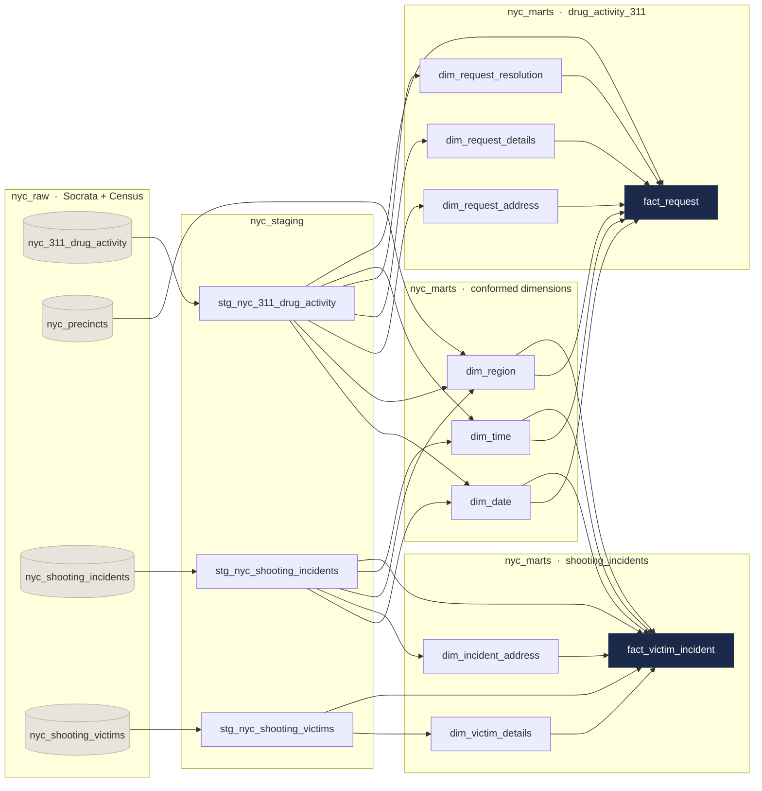

# NYC Public Safety Data Warehouse

An end-to-end analytics engineering project that ingests three NYC Open Data sources through a
scheduled serverless pipeline, models them into a Kimball star schema on BigQuery with dbt, and
serves a Looker Studio dashboard analyzing the relationship between drug-activity complaints,
NYPD enforcement outcomes, and shooting incidents across New York City.

**Stack:** Google BigQuery · Google Cloud Functions (Python) · Google Cloud Scheduler · dbt · Looker Studio · SQL

---

## What this project does

New York City publishes 311 service requests and NYPD shooting incidents as separate, unrelated
datasets. Neither can answer questions about the other. This project integrates them behind
**conformed dimensions** so that complaint patterns and violence patterns can be analyzed together
at the borough and police-precinct level, normalized per capita against 2020 Census population.

Two analytical questions drive the model:

1. How do drug-activity complaints and police response outcomes relate to shooting incidents at the
   neighborhood level, and how does that relationship shift over time?
2. How are complaints distributed across neighborhoods and time, and how does the NYPD actually
   respond (arrest, summons, or no enforcement action), and does that differ by geography?

---

## Architecture

```
NYC Open Data (Socrata API)
        │
        │  3 × Cloud Functions (Python + sodapy, 5,000-record pagination,
        │  explicit BigQuery SchemaField enforcement)
        │  triggered on a cadence by Cloud Scheduler
        ▼
┌───────────────────────┐
│       nyc_raw         │  Raw layer: source data preserved unmodified
└───────────────────────┘
        │  dbt: type casting, dedup, standardization
        ▼
┌───────────────────────┐
│     nyc_staging       │  Staging layer: 3 models
└───────────────────────┘
        │  dbt: surrogate keys, conformed dimensions, facts
        ▼
┌───────────────────────┐
│      nyc_marts        │  Star schema: 2 facts, 8 dims, 2 marts
└───────────────────────┘
        │  BigQuery views implementing KPIs
        ▼
┌───────────────────────┐
│  nyc_analytics_views  │  →  Looker Studio dashboard
└───────────────────────┘
```

### Model lineage



Full detail in [`docs/ARCHITECTURE.md`](docs/ARCHITECTURE.md).

---

## Data sources

| Source | Grain | Volume | Notes |
|---|---|---|---|
| NYC 311 Service Requests | One row per service request | ~89K raw → 84K modeled | Filtered to `agency = NYPD` and `complaint_type = 'Drug Activity'` from a 20M+ row dataset |
| NYPD Shooting Incidents | One row per incident | ~28K | Incident-level: date, time, precinct, location |
| NYPD Shooting Victims | One row per victim | ~28K → 25K modeled | Joined to incidents on `incident_key` |
| 2020 Decennial Census | One row per precinct | Precinct level | Population and geometry, used for per-capita normalization |

---

## Dimensional model

Two fact tables share three conformed dimensions — those shared dimensions are what let the two
marts be analyzed together.

**Facts**

| Table | Grain | Rows |
|---|---|---|
| `fact_request` | One 311 drug-activity service request | ~84K |
| `fact_victim_incident` | One victim per shooting incident | ~25K |

**Conformed dimensions** (shared by both facts)

| Dimension | Purpose |
|---|---|
| `dim_date` | Calendar attributes: year, quarter, month, day of week, weekend flag, fiscal year |
| `dim_time` | Time-of-day analyzis and hourly distributions |
| `dim_region` | Borough × police precinct, extended with Census population and precinct geometry |

**Mart-specific dimensions**

- Drug Activity 311: `dim_request_details`, `dim_request_resolution`, `dim_request_address`
- Shooting Incidents: `dim_victim_details`, `dim_incident_address`

All surrogate keys are generated with `dbt_utils.generate_surrogate_key()` (MD5 hashing).
Degenerate keys (`request_id`, `incident_id`, `victim_id`) are retained on the facts for
drill-through and traceability back to the source systems.

---

## Engineering problems solved

These took the longest to diagnose.

### A 133,000-row fan-out in `fact_request`

The fact table kept returning about 133K rows where the grain said 84K — `dim_request_address`
was the culprit. Identical physical addresses that sit on NYC council-district boundaries came through
with different `council_district` values, so one address produced several dimension rows and
multiplied the fact on join. Grouping on address and ZIP, then collapsing the conflicting
attributes with `MAX()`/`MIN()`, put it back to 84K.

### A 4x fan-out in the shooting mart

Here the same location type showed up with several classification combinations, so joining on
location description alone duplicated victim rows. The fix was a composite surrogate key spanning
all three location fields: `location_desc`, `classification_code`, `inside_outside_indicator`.

### Splitting the date-time dimension

An early version used a single `dim_date_time`. Cardinality got out of hand and it made temporal
analyzis awkward. Splitting it into `dim_date` and `dim_time` is what made lag analyzis and
time-of-day heatmaps possible at all.

### Duplicate keys in the source feeds

Both shooting tables ship duplicate primary keys. I handle that in staging with
`QUALIFY ROW_NUMBER()` rather than a downstream `DISTINCT`, so the grain is settled before
anything joins to it.

### Data quality anomalies

Three things in the source data would have skewed the analyzis if left alone.

- Precincts 107 and 110 (Queens) between them hold **56,032 of 84,627 complaints, 66% of the
  entire dataset**. Precinct 107 alone records 3,136 complaints per 10,000 residents against 278
  for the highest genuine precinct — an 11× gap. 311 assigns precinct from caller input rather than
  geocoding the incident, so these two appear to act as fallback values when a request cannot be
  located. Both are excluded from precinct-level maps, and the effect is visible in the committed
  [analytics output](data/analytics_output/).
- Complaint volume rises roughly 24× between 2020 and 2025, which is not a credible change in
  actual drug activity. It reflects changes in 311 intake and categorization. Shooting counts over
  the same window stay flat, and are the more trustworthy series.
- Precinct 22 (Central Park) has a recorded residential population of 25, which makes any
  per-capita rate meaningless. Excluded via a population threshold.
- A corrupt `victim_age_group` value of `1022` was mapped to `Unknown`.
- The 311 feed contains a genuine gap between roughly April 2021 and January 2022, consistent with
  reduced 311 activity during COVID lockdown. This exists in the upstream source and is documented
  rather than patched.

---

## Metrics implemented

| Metric | Definition |
|---|---|
| Drug Activity Complaint Rate | Complaints per 10,000 residents, by precinct |
| Shooting Incident Rate | Shooting incidents per 10,000 residents, by precinct and borough |
| Drug Activity–Shooting Correlation | Pearson correlation of monthly complaint and shooting rates, citywide and by borough |
| Lag Correlation | Correlation between complaint volume and shootings 1–2 months later — more defensible than a direct ratio |
| Enforcement Outcome Distribution | Share of complaints by NYPD resolution (arrest, summons, no action), by borough |
| Hotspot Score | Min-max normalized composite of per-capita complaint and shooting rates |
| Shooting Fatality Rate | Share of shooting incidents resulting in a fatality, by borough |

**Headline figures from the final warehouse:** 84.6K drug-activity complaints · 20.1K shooting
victim incidents · 19.83% fatality rate · 3,918 murders.

---

## Repository layout

```
cloud_functions/                        # ingestion: one function per source dataset
├── load_311_drug_activity/
├── load_shooting_incidents/
└── load_shooting_victims/

models/work/
├── staging/
│   ├── sources.yml                     # source definitions + uniqueness/not-null tests
│   ├── stg_nyc_311_drug_activity.sql
│   ├── stg_nyc_shooting_incidents.sql
│   └── stg_nyc_shooting_victims.sql
└── marts/
    ├── schema.yml                      # model documentation + referential integrity tests
    ├── shared/                         # conformed dimensions
    │   ├── dim_date.sql
    │   ├── dim_time.sql
    │   └── dim_region.sql
    ├── drug_activity_311/
    │   ├── dim_request_details.sql
    │   ├── dim_request_resolution.sql
    │   ├── dim_request_address.sql
    │   └── fact_request.sql
    └── shooting_incidents/
        ├── dim_victim_details.sql
        ├── dim_incident_address.sql
        └── fact_victim_incident.sql

macros/generate_schema_name.sql         # prevents dbt prefixing dataset names per developer
analyzes/analytics_views.sql            # BigQuery analytics-layer view definitions
data/analytics_output/                  # materialized view results (committed)
nyc_precincts.csv                       # 2020 Census precinct population + geometry
docs/
├── ARCHITECTURE.md                     # pipeline design and rationale
└── dimensional-model.pdf               # full star schema diagram
```

`models/work/marts/schema.yml` doubles as the data dictionary. Every model and column is
described there, alongside the tests.

---

## Running it

The ingestion functions are deployed separately. See
[`cloud_functions/README.md`](cloud_functions/README.md) for their configuration and
`gcloud` deploy commands.

For the warehouse itself: requires a BigQuery project with the raw datasets loaded and a dbt
profile named `default`. The GCP project is read from an environment variable rather than
hardcoded:

```bash
export DBT_GCP_PROJECT=your-gcp-project

dbt deps          # install dbt_utils and codegen
dbt build         # run all models and execute all tests
dbt docs generate && dbt docs serve
```

`dbt build` runs models in dependency order and executes the tests defined in
`models/work/staging/sources.yml` and `models/work/marts/schema.yml`.

---

## About this project

I designed and built this warehouse end to end: the ingestion functions, the staging layer, the
dimensional model, the dbt project, and the analytics views behind the dashboard. The
commit history tracks that work from the first staging model through to the final star schema.

---

## License

MIT. See [LICENSE](LICENSE).
