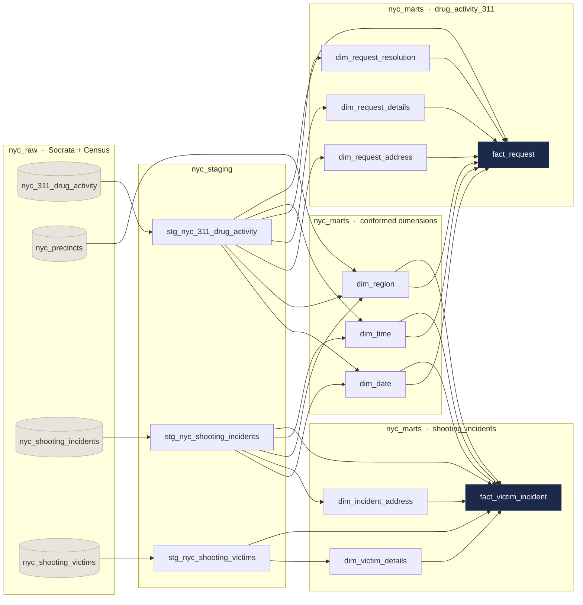

# Architecture

How the data gets from NYC Open Data into the warehouse and out to the dashboard.

## Raw

Three Cloud Functions, one per source dataset. Each queries the Socrata API with the `sodapy`
client, pages through the results 5,000 records at a time, and writes into the `nyc_raw` dataset.
Schemas are defined explicitly with `SchemaField` rather than autodetected, so the load errors out
if a source column changes type instead of writing bad data into the table. Cloud Scheduler
triggers each function.

| Cloud Function | Target table | Sort field | Filter |
|---|---|---|---|
| `load-311nyc-drug-activity-data` | `nyc_311_drug_activity` | `created_date` | `complaint_type = 'Drug Activity'` |
| `load-nyc-shooting-incidents` | `nyc_shooting_incidents` | `occur_date` | none (full load) |
| `load-nyc-shooting-victims` | `nyc_shooting_victims` | `incident_key` | none (full load) |

Nothing modifies the raw layer. I kept it exactly as received so any transformation bug can be
reproduced and undone without hitting the API again.

## Staging

Three dbt models in `nyc_staging`, each following the same `source → cleaned → final` CTE pattern.
What happens here:

- Borough values are standardized to title case across all three tables. Without this the conformed
  region dimension doesn't join.
- Datetime fields are split into separate date and time components and cast to `DATE`/`TIMESTAMP`
  and `TIME`, which is what lets the facts join to `dim_date` and `dim_time` independently.
- Duplicates are removed with `QUALIFY ROW_NUMBER()` on the primary keys. Doing it here rather than
  downstream means the grain is settled before anything joins to it.
- `stat_murder_flg` goes from a `Y`/`N` string to a `BOOLEAN`.
- A corrupt `victim_age_group` value of `1022` is mapped to `Unknown`.
- ZIP codes are validated and standardized.

`sources.yml` registers all the raw tables under one `raw` source, with column descriptions and
uniqueness and not-null tests on every primary key.

## Marts

The star schema, built in `nyc_marts`. dbt's DAG builds every dimension before the facts that
reference it, so referential integrity holds without needing to enforce it separately.

Two marts share three conformed dimensions:

`dbt_project.yml` maps each model subfolder to its BigQuery dataset. The `generate_schema_name`
macro overrides dbt's default of prefixing dataset names with the developer's username, which
otherwise gives every contributor a different set of output datasets.

## Analytics

A set of BigQuery views in `nyc_analytics_views` on top of the marts. They join across both fact
tables through the conformed dimensions and implement the KPIs: per-capita rates, Pearson and lag
correlations, enforcement outcome distributions, and the composite hotspot score.

Keeping the KPI logic in its own view layer leaves the star schema generic, and the dashboard never
queries the fact tables directly. Looker Studio connects here.

## Why it's built this way

The four layers fail for different reasons and it's much easier to debug them separately. An API
change breaks ingestion. A shift in source data quality breaks staging. Misunderstanding the
business grain breaks the marts. A changed metric definition breaks analytics. With fewer layers,
every one of those turns into a full-pipeline investigation.

I used conformed dimensions rather than merging the two datasets into one fact table because their
grains are genuinely different: one row per complaint against one row per victim. Merging them
would mean either aggregating away detail or inventing a shared grain that doesn't exist. Sharing
`dim_date`, `dim_time` and `dim_region` lets each fact keep its own grain and still supports
analysis across both at the borough and precinct level.

Surrogate keys are used throughout because the source identifiers aren't stable and two of the
three feeds ship duplicate primary keys. MD5 keys from `dbt_utils.generate_surrogate_key()` keep
the warehouse insulated from source-side key changes, and the original identifiers stay on the
facts as degenerate keys so rows can still be traced back.
