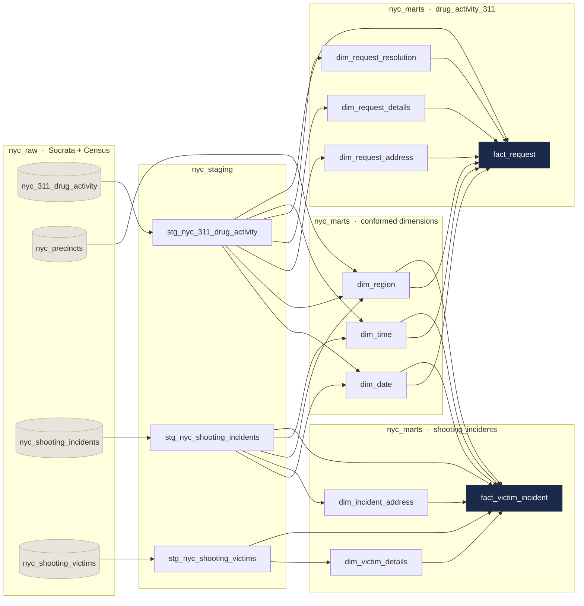

# Architecture

How data moves from NYC Open Data into the warehouse and out to the dashboard, and why each
layer exists.

---

## Layer 1: extract and load (raw)

Three independent Google Cloud Functions, one per source dataset. Each function:

- queries the NYC Open Data Socrata API using the `sodapy` client
- paginates through results in chunks of 5,000 records
- enforces an explicit BigQuery schema through `SchemaField` definitions rather than relying on
  autodetection, so a source-side type change fails loudly instead of silently corrupting a column
- writes into the `nyc_raw` dataset

Cloud Scheduler triggers each function on a defined cadence.

| Cloud Function | Target table | Sort field | Filter |
|---|---|---|---|
| `load-311nyc-drug-activity-data` | `nyc_311_drug_activity` | `created_date` | `complaint_type = 'Drug Activity'` |
| `load-nyc-shooting-incidents` | `nyc_shooting_incidents` | `occur_date` | none (full load) |
| `load-nyc-shooting-victims` | `nyc_shooting_victims` | `incident_key` | none (full load) |

**The raw layer is never modified.** Data is preserved exactly as received so that any
transformation bug is reproducible and reversible without re-hitting the API.

---

## Layer 2: staging

Three dbt models in `nyc_staging`, each following a consistent `source → cleaned → final`
CTE pattern. Transformations applied here:

- borough values standardized to title case across all three tables, so the conformed region
  dimension joins cleanly
- datetime fields split into separate date and time components, cast to `DATE`/`TIMESTAMP` and
  `TIME`, which is what allows independent joins to `dim_date` and `dim_time`
- duplicate rows removed with `QUALIFY ROW_NUMBER()` on primary keys. Doing this at staging
  rather than downstream guarantees the grain before anything joins
- `stat_murder_flg` converted from a `Y`/`N` string to a proper `BOOLEAN`
- a corrupt `victim_age_group` value of `1022` mapped to `Unknown`
- ZIP codes validated and standardized

`sources.yml` registers all raw tables under a single `raw` source with column descriptions and
uniqueness/not-null tests on every primary key.

---

## Layer 3: marts (dimensional model)

The star schema, built in `nyc_marts`. dbt's DAG guarantees every dimension is built before
the fact tables that reference it, so referential integrity holds by construction.

Two marts share three conformed dimensions:

### Model lineage

Generated from the `ref()` and `source()` calls in the models, so it cannot drift from the code.

`dbt_project.yml` maps each model subfolder to its BigQuery dataset. The
`generate_schema_name` macro overrides dbt's default behavior of prefixing dataset names with
the developer's username, so output datasets are consistent across contributors.

---

## Layer 4: analytics

A set of BigQuery views in `nyc_analytics_views` sitting on top of the marts. These views join
across both fact tables through the conformed dimensions and implement the project's KPIs:
per-capita rates, Pearson and lag correlations, enforcement outcome distributions, and the
composite hotspot score.

Keeping the KPI logic in a separate view layer means the star schema stays generic and the
dashboard never queries fact tables directly.

Looker Studio connects to this layer.

---

## Why this shape

Splitting raw, staging, marts, and analytics separates concerns that fail for different reasons.
Ingestion breaks when an API changes. Staging breaks when source data quality shifts. The mart
layer breaks when the business grain is misunderstood. Analytics breaks when a metric definition
changes. Collapsing these into fewer layers makes every failure a full-pipeline debug.

**Conformed dimensions over a merged fact table.** The two datasets have genuinely different
grains — one row per complaint versus one row per victim. Forcing them into a single fact table
would require either aggregating away detail or fabricating a shared grain. Sharing `dim_date`,
`dim_time`, and `dim_region` instead lets each fact keep its natural grain while still supporting
cross-dataset analysis at the borough and precinct level.

Surrogate keys are used throughout because source identifiers are unstable, and two of the three feeds ship
duplicate primary keys. MD5 surrogate keys via `dbt_utils.generate_surrogate_key()` isolate the
warehouse from source-side key changes; the original identifiers are retained as degenerate keys
on the facts for traceability.
